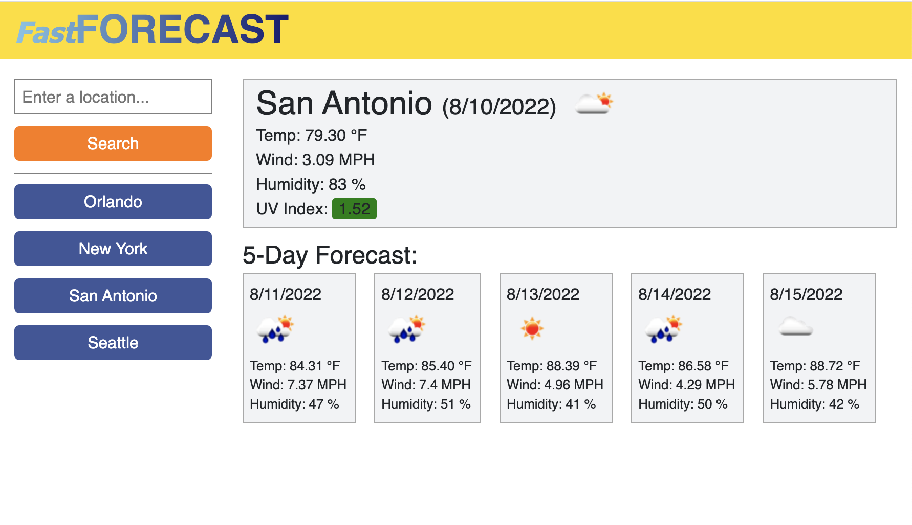
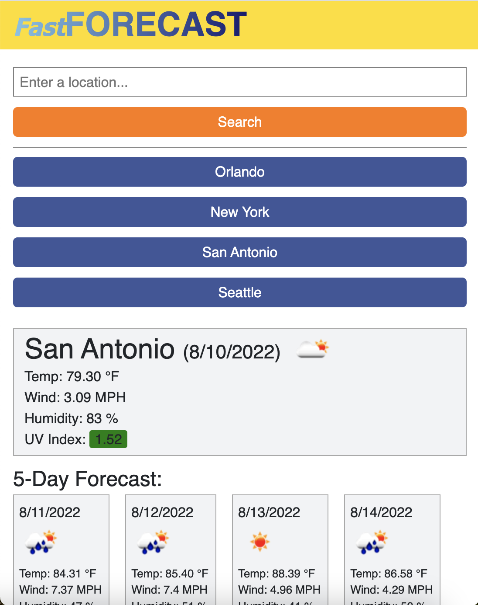

# FastFORECAST #

## Objective ##

>I built this project in order to practice working with server-side APIs. I leveraged [openweathermap.org](https://openweathermap.org/)'s API to dynamically display current weather conditions and a 5-day forecast based on user input. The application uses local storage to save and retrieve the search history. This project also exhibits my continued effort to understand and weild jquery and bootstrap.

## Challenges

>Much of the time spent on this project involved learning the ins and outs of the API. For example, data results were more reliable when calling the API using coordinates for latitude and longitude rather than using city or city and state. Thus it was necessary to first convert the user's search input to latitude and longitude by making a call to a seperate API built for that purpose. 

## Built with:

* HTML
* CSS
* Javascript

## Website:

[Visit the site on Github Pages.](https://jonprice0.github.io/weather-dashboard/)

## Here are screenshots of the finished page:

## License

> Naturally, I have not included a license for this simple exercise. :)

## Contributions:

>Made from scratch by Jonathan Price using the OpenWeather API.
